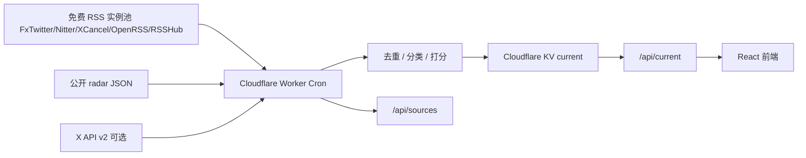

# Codex 重置雷达架构

阶段：Super Dev docs
状态：等待确认

## 总览



## 主链路

Cloudflare Worker 每 15 分钟：

1. `fetchFreeRssPool()`：读取 `FREE_RSS_TEMPLATES`。
2. `fetchPublicRadar()`：读取公开 JSON。
3. `fetchOfficialX()`：仅当 `X_BEARER_TOKEN` 存在时启用。
4. `mergeSignals()`：按 URL/id 去重。
5. `scoreSnapshot()`：最高证据决定概率上限。
6. 写入 KV。

## API

### GET `/api/current`

返回当前 `RadarSnapshot`。

### GET `/api/current?refresh=1`

强制刷新并返回最新快照。

### GET `/api/sources`

返回每个免费 RSS 源的健康探测结果：

```json
{
  "checkedAt": "2026-05-31T20:30:00+08:00",
  "sources": [
    {
      "handle": "thsottiaux",
      "url": "https://nitter.net/thsottiaux/rss",
      "ok": false,
      "status": 200,
      "itemCount": 0,
      "latencyMs": 813
    }
  ]
}
```

## 兜底顺序

1. 免费 RSS 实例池命中，并且不是 whitelist / challenge / 空 feed / HTML 页面
2. 公开 radar JSON
3. RSSHub 弱兜底
4. 内置静态种子

## 部署

- 前端：Cloudflare Worker 从 KV 提供静态资源
- API：Cloudflare Worker
- 路由：`codex-reset-radar.sumerchaser.top/*`
- 缓存：Cloudflare KV
- 定时：Worker Cron `*/15 * * * *`

## 风险

- 公共 RSS/Nitter/OpenRSS/RSSHub 实例随时可能 403 或返回 HTML。
- FxTwitter 现在可用，但仍属于第三方免费源，需要保留兜底。
- XCancel RSS 可用但需要白名单。
- RSSHub demo 明确不适合生产。
- X 官方 API 需要 token 和费用。

## 风险处理

- 源健康检查透明化。
- 多源并发探测。
- 失败自动降级。
- 不在 UI 声称“官方确认重置”，只说“捕捉到信号”。
